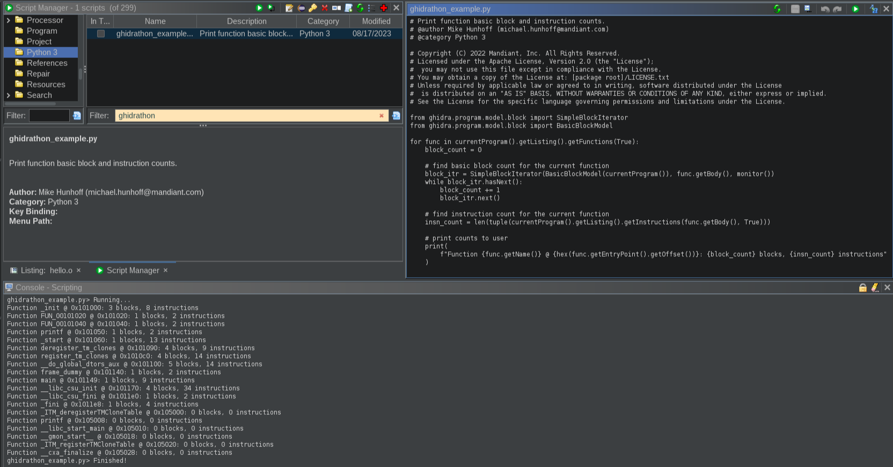

# Ghidrathon

[](https://github.com/mandiant/Ghidrathon/releases)
[](https://github.com/mandiant/Ghidrathon/releases)
[](https://github.com/mandiant/ghidrathon/actions/workflows/tests.yml)
[](LICENSE.txt)

Ghidrathon is a Ghidra extension that adds Python 3 scripting capabilities to Ghidra. Why? Ghidra natively supports scripting in Java and Jython. Unfortunately, many open-source analysis tools, like [capa](https://github.com/mandiant/capa), [Unicorn Engine](https://github.com/unicorn-engine/unicorn), [angr](https://github.com/angr/angr), etc., are written in Python 3 making it difficult, and in some cases, impossible to use these tools in Ghidra. More so the security community has released several great plugins for other SRE frameworks like IDA Pro and Binary Ninja, but again, because many of these plugins use Python 3 it is difficult to port them to Ghidra. Ghidrathon helps you use existing and develop new Python 3 tooling in Ghidra and script Ghidra using modern Python in a way that tightly integrates with Ghidra's UI. It replaces the existing Python 2.7 extension implemented via Jython. This includes the interactive interpreter window, integration with the Ghidra Script Manager, and script execution in Ghidra headless mode.


Please see our Ghidra Python 3 script example [here](./ghidra_scripts/ghidrathon_example.py) for a closer look at writing Python 3 scripts for Ghidra.

Check out:

- The overview in our first [Ghidrathon blog post](https://www.mandiant.com/resources/blog/ghidrathon-snaking-ghidra-python-3-scripting)

## Installing Ghidrathon

### Requirements
Tool | Version |Source |
|---|---|---|
| Ghidrathon | `>= 4.0.0` | https://github.com/mandiant/Ghidrathon/releases |
| Python | `>= 3.8.0` | https://www.python.org/downloads |
| Jep | `== 4.2.0` | https://pypi.org/project/jep |
| Ghidra | `>= 10.3.2` | https://github.com/NationalSecurityAgency/ghidra/releases |
| Java | `>= 17.0.0` | https://adoptium.net/temurin/releases |

Use the following steps to install Ghidrathon to your Ghidra environment:

1. Download and unzip the latest Ghidrathon [release](https://github.com/mandiant/Ghidrathon/releases)
2. Execute the following commands using the Python interpreter that you'd like to use with Ghidrathon ([requirements.txt](https://github.com/mandiant/Ghidrathon/blob/main/util/requirements.txt) and [ghidrathon_configure.py](https://github.com/mandiant/Ghidrathon/blob/main/util/ghidrathon_configure.py) are included in the release):
```
$ python -m pip install -r requirements.txt
$ python ghidrathon_configure.py <absolute_path_to_ghidra_install_dir>
```
**Note**: `ghidrathon_configure.py` by default attempts to write a file named `ghidrathon.save` to `<absolute_path_to_ghidra_install_dir>`. You can specify the path where this file is written by setting the `GHIDRATHON_SAVE_PATH` environment variable before running `ghidrathon_configure.py` and Ghidra:
```
$ export GHIDRATHON_SAVE_PATH="/path/to/custom/dir" # Linux/MacOS
$ set GHIDRATHON_SAVE_PATH="C:\path\to\custom\dir"  # Windows
```
**Note**: you may be prompted to set an environment variable named `JAVA_HOME`. This should reference the absolute path of the JDK that you have configured for your Ghidra install.

3. Install the Ghidrathon extension (`.zip`) into Ghidra:
   * Using Ghidra's UI:
        * Navigate to `File > Install Extensions...`
        * Click the green `+` button
        * Navigate to the Ghidrathon extension (`.zip`)
        * Click `Ok`
        * Optional
           * Select `Install Anyway` if prompted by `Extension Version Mismatch` window
    * Using a limited environment:
        * Extract the Ghidrathon extension (`.zip`)  to `<absolute_path_to_ghidra_install_dir>\Ghidra\Extensions`

### Switching Python Interpreters

You can switch Ghidrathon to use a different Python interpreter by executing step `2` using the new Python interpreter.

### Using Python Virtual Environments

You can use a Python virtual environment with Ghidrathon by executing step `2` from the virtual environment. To switch to a different virtual environment, simply execute step `2` from the new virtual environment.

## Using Ghidrathon

### Python 3 Interpreter Window

The interpreter window provides interactive access to your Python 3 interpreter. Click "Window" and select "Ghidrathon" to open the interpreter window.


### Ghidra Script Manager Integration

Ghidrathon integrates directly with the Ghidra Script Manager enabling you to create, edit, and execute Python 3 scripts within Ghidra. Click "Create New Script" and select "Python 3" to create a new Python 3 script. Click "Run Script" or "Run Editors's Script" to execute your Python 3 script and check the Ghidra Console window for script output.



### Ghidra Headless Mode

Ghidrathon helps you execute Python 3 scripts in Ghidra headless mode. Execute the `analyzeHeadless` script located in your Ghidra installation folder, specify your Python 3 script, and check the console window for script output.

```
$ analyzeHeadless C:\Users\wampus example -process example.o -postScript ghidrathon_example.py
[...]
INFO  SCRIPT: C:\Users\wampus\.ghidra\.ghidra_10.0.3_PUBLIC\Extensions\Ghidrathon-master\ghidra_scripts\ghidrathon_example.py (HeadlessAnalyzer)
Function _init @ 0x101000: 3 blocks, 8 instructions
Function FUN_00101020 @ 0x101020: 1 blocks, 2 instructions
Function __cxa_finalize @ 0x101040: 1 blocks, 2 instructions
Function printf @ 0x101050: 1 blocks, 2 instructions
Function _start @ 0x101060: 1 blocks, 13 instructions
Function deregister_tm_clones @ 0x101090: 4 blocks, 9 instructions
Function register_tm_clones @ 0x1010c0: 4 blocks, 14 instructions
Function __do_global_dtors_aux @ 0x101100: 5 blocks, 14 instructions
[...]
INFO  REPORT: Post-analysis succeeded for file: /example.o (HeadlessAnalyzer)
INFO  REPORT: Save succeeded for processed file: /example.o (HeadlessAnalyzer)
```

For more information on running Ghidra in headless mode check out `<absolute_path_to_ghidra_install_dir>/support/analyzeHeadlessREADME.html`.

## Third-Party Python Modules

One of our biggest motivations in developing Ghidrathon was to enable use of third-party Python 3 modules in Ghidra. You can install a module and start using it inside Ghidra just as you would a typical Python setup. This also applies to modules you have previously installed. For example, we can install and use Unicorn to emulate ARM code inside Ghidra.


## Writing Ghidra Python 3 Scripts

Ghidrathon provides a scripting experience that closely mirrors Ghidra's Java and Jython extensions which includes making `GhidraScript` state instance variables, e.g. `currentProgram`, and `FlatProgramAPI` methods, e.g. `findBytes` 
available at the Python `builtins` scope. This means _all_ Python modules that are imported by your code have access to these variables and methods. Ghidrathon diverges slightly from Ghidra's Java and Jython extensions by exposing `GhidraScript` 
state variables as Python function calls versus direct accesses e.g. your Python 3 code must access `currentProgram` using the function call `currentProgram()`. This small change ensures that your Python 3 code is provided the correct `GhidraScript` state variables during execution. Please see our Ghidra Python 3 script example [here](./ghidra_scripts/ghidrathon_example.py) for a closer look at writing Python 3 scripts for Ghidra.

## How does it work?

Ghidrathon links your local Python installation to Ghidra using the open-source project [Jep](https://github.com/ninia/jep). Essentially your local Python interpreter is running inside Ghidra with access to all your Python packages **and** the standard Ghidra scripting API. Ghidrathon also works with Python virtual environments helping you create, isolate, and manage packages you may only want installed for use in Ghidra. Because Ghidrathon uses your local Python installation you have control over the Python version and environment running inside Ghidra.

For more information on how Jep works to embed Python in Java see their documentation [here](https://github.com/ninia/jep/wiki/How-Jep-Works).

## Considerations

Ghidrathon uses the open-source library [Jep](https://github.com/ninia/jep) which uses the Java Native Interface (JNI) to embed Python in the JVM. The Ghidra developers advise against JNI in Ghidra for reasons discussed [here](https://github.com/NationalSecurityAgency/ghidra/issues/175).
