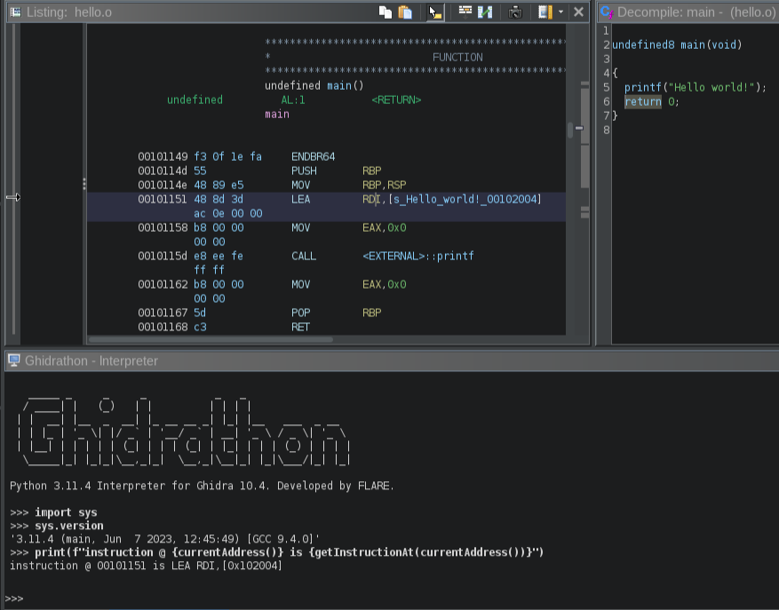
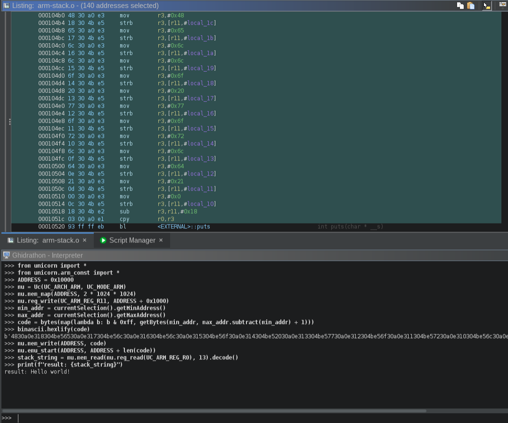

# Ghidrathon

[](LICENSE.txt)

Ghidrathon is a Ghidra extension that adds Python 3 scripting capabilities to Ghidra. Why? Ghidra natively supports scripting in Java and Jython. Unfortunately many open-source analysis tools, like [capa](https://github.com/mandiant/capa), [Unicorn Engine](https://github.com/unicorn-engine/unicorn), [angr](https://github.com/angr/angr), etc., are written in Python 3 making it difficult, and in some cases, impossible to use these tools in Ghidra. More so the security community has released several great plugins for other SRE frameworks like IDA Pro and Binary Ninja, but again, because many of these plugins use Python 3 it is difficult to port them to Ghidra. Ghidrathon helps you use existing and develop new Python 3 tooling in Ghidra and script Ghidra using modern Python in a way that tightly integrates with Ghidra's UI.

Check out:

- The overview in our first [Ghidrathon blog post](https://www.mandiant.com/resources/blog/ghidrathon-snaking-ghidra-python-3-scripting)

Ghidrathon replaces the existing Python 2 extension implemented via Jython. This includes the interactive interpreter window, integration with the Ghidra Script Manager, and script execution in Ghidra headless mode. 

## Python 3 Interpreter Window

The interpreter window provides interactive access to your Python 3 interpreter. Click "Window" and select "Ghidrathon" to open the interpreter window.



## Ghidra Script Manager Integration

Ghidrathon integrates directly with the Ghidra Script Manager enabling you to create, edit, and execute Python 3 scripts within Ghidra. Click "Create New Script" and select "Python 3" to create a new Python 3 script. Click "Run Script" or "Run Editors's Script" to execute your Python 3 script and check the Ghidra Console window for script output.


## Ghidra Headless Mode

Ghidrathon helps you execute Python 3 scripts in Ghidra headless mode. Execute the `analyzeHeadless` script located in your Ghidra installation folder, specify your Python 3 script, and check the console window for script output.

```
$ analyzeHeadless C:\Users\wampus example -process example.o -postScript ghidrathon_example.py
...
INFO  SCRIPT: C:\Users\wampus\.ghidra\.ghidra_10.0.3_PUBLIC\Extensions\Ghidrathon-master\ghidra_scripts\ghidrathon_example.py (HeadlessAnalyzer)
Function _init @ 0x101000: 3 blocks, 8 instructions
Function FUN_00101020 @ 0x101020: 1 blocks, 2 instructions
Function __cxa_finalize @ 0x101040: 1 blocks, 2 instructions
Function printf @ 0x101050: 1 blocks, 2 instructions
Function _start @ 0x101060: 1 blocks, 13 instructions
Function deregister_tm_clones @ 0x101090: 4 blocks, 9 instructions
Function register_tm_clones @ 0x1010c0: 4 blocks, 14 instructions
Function __do_global_dtors_aux @ 0x101100: 5 blocks, 14 instructions
Function frame_dummy @ 0x101140: 1 blocks, 2 instructions
Function main @ 0x101149: 1 blocks, 9 instructions
Function __libc_csu_init @ 0x101170: 4 blocks, 34 instructions
Function __libc_csu_fini @ 0x1011e0: 1 blocks, 2 instructions
Function _fini @ 0x1011e8: 1 blocks, 4 instructions
Function _ITM_deregisterTMCloneTable @ 0x105000: 0 blocks, 0 instructions
Function printf @ 0x105008: 0 blocks, 0 instructions
Function __libc_start_main @ 0x105010: 0 blocks, 0 instructions
Function __gmon_start__ @ 0x105018: 0 blocks, 0 instructions
Function _ITM_registerTMCloneTable @ 0x105020: 0 blocks, 0 instructions
Function __cxa_finalize @ 0x105028: 0 blocks, 0 instructions
...
INFO  REPORT: Post-analysis succeeded for file: /example.o (HeadlessAnalyzer)
INFO  REPORT: Save succeeded for processed file: /example.o (HeadlessAnalyzer)
```

For more information on running Ghidra in headless mode check out `<ghidra_install>/support/analyzeHeadlessREADME.html`.

## Third-Party Python Modules

One of our biggest motivations in developing Ghidrathon was to enable use of third-party Python 3 modules in Ghidra. You can install a module and start using it inside Ghidra just as you would a typical Python setup. This also applies to modules you have previously installed. For example, we can install and use Unicorn to emulate ARM code inside Ghidra.



## How does it work?

Ghidrathon links your local Python installation to Ghidra using the open-source project [Jep](https://github.com/ninia/jep). Essentially your local Python interpreter is running inside Ghidra with access to all your Python packages **and** the standard Ghidra scripting API. Ghidrathon also works with Python virtual environments helping you create, isolate, and manage packages you may only want installed for use in Ghidra. Because Ghidrathon uses your local Python installation you have control over the Python version and environment running inside Ghidra.

For more information on how Jep works to embed Python in Java see their documentation [here](https://github.com/ninia/jep/wiki/How-Jep-Works).

## OS Support

Ghidrathon supports the following operating systems:

* Linux
* Windows

## Requirements

The following tools are needed to build, install, and run Ghidrathon:

Tool | Version |Source |
|---|---|---|
| Ghidra | `>= 10.2` | https://ghidra-sre.org |
| Jep | `>= 4.1.1` | https://github.com/ninia/jep |
| Gradle | `>= 7.3` | https://gradle.org/releases |
| Python | `>= 3.7` | https://www.python.org/downloads |

Note: Ghidra >= 10.2 requires [JDK 17 64-bit](https://adoptium.net/temurin/releases/).

## Python Virtual Environments

Ghidrathon supports Python virtual environments. To use a Python virtual environment, simply build Ghidrathon inside your virtual environment **and** execute Ghidra inside the **same** virtual environment.

## Building Ghidrathon

**Note:** Review [Python Virtual Environments](#python-virtual-environments) before building if you would like to use a Python virtual environment for Ghidrathon.

**Note**: Building Ghidrathon requires building Jep. If you are running Windows, this requires installing the Microsoft C++ Build Tools found [here](https://visualstudio.microsoft.com/visual-cpp-build-tools/). See Jep's documentation [here](https://github.com/ninia/jep/wiki/Windows) for more information on installing Jep on Windows.

Use the following steps to build Ghidrathon for your environment:

* Install Ghidra using the documentation [here](https://htmlpreview.github.io/?https://github.com/NationalSecurityAgency/ghidra/blob/stable/GhidraDocs/InstallationGuide.html#InstallationNotes)
* Install Gradle from [here](https://gradle.org/releases)
* Download the latest Ghidrathon source release from [here](https://github.com/mandiant/Ghidrathon/releases)
* Run the following command from the Ghidrathon source directory:
    * **Note:** Ghidrathon defaults to the Python binary found in your path. You can specify a different Python binary by adding the optional argument `-PPYTHON_BIN=<absolute path to Python binary>` to the command below
    * **Note:** you may optionally set an environment variable named `GHIDRA_INSTALL_DIR` instead of specifying `-PGHIDRA_INSTALL_DIR`

```
$ gradle -PGHIDRA_INSTALL_DIR=<absolute path to Ghidra install>
```

This command installs Jep, configures Ghidrathon with the necessary Jep binaries, and builds Ghidrathon. If successful, you will find a new directory in your Ghidrathon source directory named `dist` containing your Ghidrathon extension (`.zip`). Please open a new issue if you experience any issues building Ghidrathon.

## Installing Ghidrathon

Use the following steps to install your Ghidrathon extension in Ghidra:

* Start Ghidra
* Navigate to `File > Install Extensions...`
* Click the green `+` button
* Navigate to your Ghidrathon extension built earlier (`.zip`)
* Click `Ok`
* Restart Ghidra

### Disabling Jython

Ghidrathon disables the built-in Jython script provider to avoid conflicts when Ghidra decides which provider should handle scripts with the `.py` file extension. This means existing Jython scripts cannot be executed with Ghidrathon installed. We recommend completely disabling the Jython extension.

Use the following steps to disable the Jython extension:

* Navigate to `File > Configure...`
* Click `Ghidra Core`
* Un-check `PythonPlugin`

Use the following steps to enable the Jython extension:

* Uninstall Ghidrathon
* Enable the Jython extension using the steps outlined above
* Restart Ghidra

## Using Ghidrathon

See [Python 3 Interpreter Window](#python-3-interpreter-window), [Ghidra Script Manager Integration](#ghidra-script-manager-integration), and [Ghidra Headless Mode](#ghidra-headless-mode) for more information about using Ghidrathon.

## Considerations

Ghidrathon uses the open-source library [Jep](https://github.com/ninia/jep) which uses the Java Native Interface (JNI) to embed Python in the JVM. The Ghidra developers advise against JNI in Ghidra for reasons discussed [here](https://github.com/NationalSecurityAgency/ghidra/issues/175).
